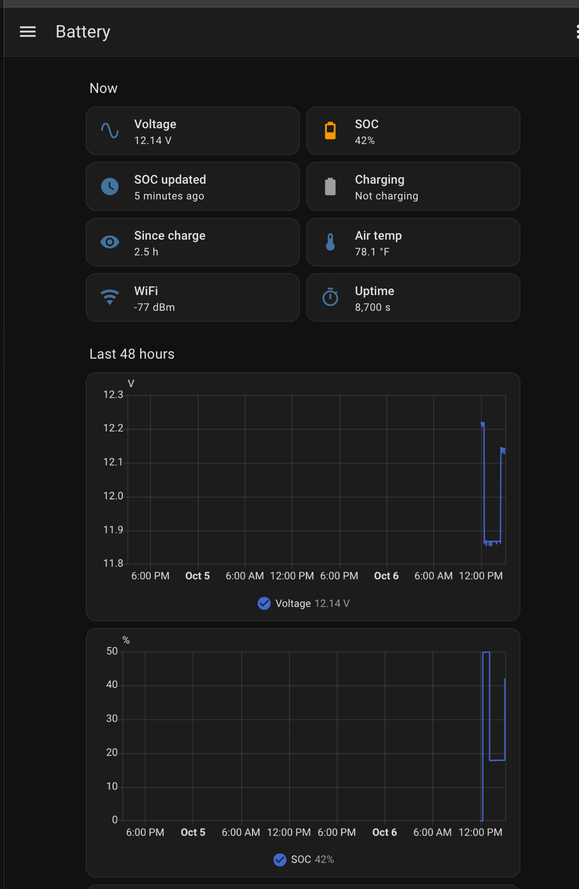

# Irin

**The wakeful one: an always-on battery watcher for Home Assistant.**

Irin is an always-on battery monitor that clamps onto a battery's terminals and reports
**voltage, state of charge (SOC), charging activity and temperature** to
[Home Assistant](https://www.home-assistant.io/) over WiFi, with a tiny OLED readout on
the device itself.

The prototype watches the 12V accessory battery of a 2027 Subaru Uncharted GT (an EV whose
12V battery can run down in a couple of days of parking), but nothing in it is
car-specific. Change a few lines of configuration and it monitors **flooded lead-acid,
AGM, LiFePO4 or sodium-ion** batteries in **12V, 24V or 48V** systems: RVs and boats,
ham radio go-boxes and repeater power, solar and home backup banks, golf carts, stored
vehicles.

No cloud, no vehicle telematics, no OBD dongle: one ESP32 board on the battery, one
entry in your Home Assistant.

<p align="center">
  
</p>
<p align="center"><sub>The included dashboard on the bench prototype. SOC steps only
after a rest window (0% from an early reboot loop, then 50%, ~17% and 42% as the bench
supply was changed); voltage is charted continuously. And 42% is, of course, the
answer.</sub></p>

### The name

*Irin* (Aramaic עִירִין, *ʿirin*; singular *ʿir*) means "watchers", literally "the
wakeful ones": those who do not sleep. It is the word for the Watchers of the Book of
Enoch, whose first part (1 Enoch 1–36) is called *The Book of the Watchers* and survives
in Aramaic among the Dead Sea Scrolls. The same word appears in Daniel 4:13: "a watcher
and a holy one came down from heaven."

The name is meant in the sense of the *holy* Watchers, the ones who kept their post
(1 Enoch 20 names them: Uriel, Raphael, Raguel, Michael, Saraqael, Gabriel and Remiel),
not the fallen ones the book is better known for.

It is also the design in one word. Deep sleep was evaluated and rejected (on the
prototype it would buy about 2% more runway), so the monitor stays awake around the
clock, watching the battery so you don't have to.

---

## What it does

| | |
|---|---|
| **Voltage** | Measured every 30 s with a 16-bit ADC (0.7 mV resolution at 12V) and published continuously, never gated. Charts charging cycles in detail. |
| **State of charge** | Looked up from *resting* voltage, temperature-corrected, and only updated when the battery has truly rested (see below). Holds its last good value otherwise, with a "last updated" timestamp. |
| **Charging** | On/off, detected from voltage with hysteresis, plus *Time Since Charging*. Shows whether the charging source (alternator, DC-DC converter, solar, shore power) is actually doing its job. |
| **Away report** | While Home Assistant is unreachable (the car is away from home WiFi, or HA is down), the device keeps a summary: lowest voltage, lowest SOC, time below the alert level, charging time and events. Published when it reconnects, e.g. *"3.2 d: SOC min 46%, 4.0 h below 50%, 6 charges"*. Gaps under 30 minutes are ignored. |
| **Temperature / humidity** | Remote DHT22 sensor on a short cable, used for the SOC temperature correction. |
| **On-device display** | Voltage, SOC, temperature and rest/charging status on a 72×40 OLED. Blanks after 2 minutes to prevent burn-in; the BOOT button wakes it. Stays lit while charging. |
| **Home Assistant** | Native ESPHome integration (no MQTT broker), a ready-made dashboard, and history for long-term battery-health trends. Alerts are ordinary HA automations. |

It draws about **10 mA at 12V** on WiFi, and about **40 mA** while out of WiFi range with
its fallback network up (see [Fallback WiFi network](#fallback-wifi-network-and-its-power-cost)).

### Why SOC needs a "rest gate"

A battery's voltage only tells you its state of charge when it has been sitting
unloaded and uncharged for a while. During and after charging it reads high (surface
charge), so a naive voltage-to-SOC lookup reports 100% on a battery that may be
failing, and a low-battery alert fires late or never.

So SOC is recomputed only after the voltage has stayed below the charging threshold for
**30 minutes** *and* has been stable (within 5 mV per 5 minutes) for **15 minutes**.
Voltage itself is never gated: you always see the raw trace.

---

## Hardware

| Part | Notes |
|---|---|
| **01Space ESP32-C3-0.42LCD** ("ESP32-C3 SuperMini 0.42 OLED") | ESP32-C3 with a built-in 72×40 SSD1306 OLED. I2C on SDA=GPIO5 / SCL=GPIO6 (verified). |
| **ADS1115** 16-bit ADC module (e.g. HiLetgo) | I2C at 0x48 (ADDR→GND), powered from 3.3V. Battery on A0 through the divider. |
| **Voltage divider** R1/R2, 1% metal film, same series | 47k / 10k for 12V systems (see the voltage table for 24/48V). |
| **C1**, 2 nF across R2 | 2× 1000 pF mica in parallel (low leakage). |
| **MP1584EN** buck module, set to 5.0V | Feeds the board's 5V pin. 12V systems only; see 24/48V below. |
| **DHT22 / AM2302** + 3-pin JST-XH (J2) | Remote-mounted outside the enclosure, cable ≤1 m at 3.3V. |
| **Fuse** at the battery positive terminal | 5 A, DC-rated for the system voltage. Protects the wiring, not the 10 mA load. |
| **TVS diode** (optional) | P6KE18A for 12V. |
| **Enclosure** | 3D printed, PETG or ASA. |

- Full bill of materials, wiring and divider math: [`PARTS.md`](PARTS.md).
- Schematic: [`hardware/`](hardware/) (KiCad 10), PDF preview in
  [`hardware/preview.pdf`](hardware/preview.pdf).
- Breadboard layout for a 400-point board: open
  [`hardware/breadboard/breadboard.html`](hardware/breadboard/breadboard.html) in a
  browser. It is generated and checked against the schematic's netlist by
  `make_breadboard.py`.

### The one wiring rule that matters

**R2 and C1 must return to the ADS1115's own GND pin, and that ground must meet power
ground at exactly one point.** If the divider and the ADC sit on different ground paths,
the supply current's voltage drop appears in series with the measurement and gets
multiplied by the divider ratio. On the prototype, 15 mV of ground drop between two
breadboard rails became an 86 mV error at the battery, and it drifted.

---

## Build and install

### 1. Bench build
1. Set the buck module to **5.0V** before connecting it to anything.
2. Build the circuit (breadboard first is a good idea; see the layout above).
3. Power from a bench supply. Check that the OLED lights up and both I2C devices appear
   in the ESPHome log (0x3C and 0x48).

### 2. Firmware (ESPHome)
The firmware is a single ESPHome config: [`esphome/irin.yaml`](esphome/irin.yaml).

**With the Home Assistant ESPHome add-on (Device Builder):**
1. Copy the YAML into `/config/esphome/`.
2. Add the keys from [`esphome/secrets.yaml.example`](esphome/secrets.yaml.example) to
   the add-on's `secrets.yaml` (Secrets button in the add-on).
3. Plug the ESP32 into the HA host by USB, then **Install**. Later updates go over WiFi.

**Or with the ESPHome command line:** copy `secrets.yaml.example` to `secrets.yaml`, fill
it in, and run `esphome run irin.yaml`.

Change `device_name` and `friendly_name` at the top of the YAML for each monitor you
build; entity IDs in HA follow `friendly_name`. The files in this repository are the
prototype's own configuration, named "Uncharted 12V", so the HA examples use entity IDs
like `sensor.uncharted_12v_battery_voltage`. If your `friendly_name` is "RV House", for
example, replace `uncharted_12v` with `rv_house` throughout `ha_config/`.

### 3. Calibrate (two-point)
Every divider is different, so calibrate against a good meter:
1. In the YAML, comment out the `calibrate_linear` block and install. *Battery Voltage*
   now shows the raw voltage at A0 (about 2 V on a 12V system).
2. Set a bench supply near the **bottom** of your range (11.50 V for 12V) and measure it
   **at the board** with a DVM. Note the true voltage and the raw reading.
3. Repeat near the **top** of your charging range (15.00 V for 12V).
4. Enter both pairs as `raw -> true`, uncomment, and reinstall:
   ```yaml
   - calibrate_linear:
       - 2.00320 -> 11.500
       - 2.61497 -> 15.000
   ```
5. Verify at your SOC alert point (e.g. 12.22 V) and at the maximum (16.00 V). Expect
   ±0.01 V.

The fitted slope should land close to your measured (R1+R2)/R2. If it is off by more than
a few tenths of a percent, suspect the ground wiring (see above) before the resistors.

### 4. Home Assistant
1. Settings → Devices & services: the device appears under **Discovered**. Add it (the
   encryption key is `uncharted_api_key` from your secrets).
2. Check the entity IDs. **Gotcha:** if the device is assigned to an area, HA may prefix
   new entity IDs with it (`sensor.garage_…`). Rename them, or edit the dashboard to
   match.
3. Dashboard: create a new dashboard, open the **Raw configuration editor**, and paste
   [`ha_config/dashboard.yaml`](ha_config/dashboard.yaml). For a
   single card on an existing dashboard, use
   [`ha_config/dashboard_card.yaml`](ha_config/dashboard_card.yaml).
4. Alerts: draft automations are in [`ha_config/`](ha_config/) (low SOC, charging
   stalled, device offline). Tune thresholds against a week or two of your own data
   before relying on them.

### 5. Install on the battery
- Ring terminals directly on the battery posts, fuse within ~15 cm (6") of the positive
  terminal. No splicing into vehicle harnesses.
- **If the battery has a current sensor clamped on its negative post** (many modern
  vehicles do), connect the monitor's ground on the chassis side of the sensor, so the
  vehicle still accounts for the monitor's current.
- Remote temperature sensor outside the enclosure, near the battery.
- Check the WiFi signal tile in HA at the final location before closing everything up.
  Below about −80 dBm, expect dropouts.

---

## Customizing

Everything you need to change is in the `substitutions:` block at the top of
[`esphome/irin.yaml`](esphome/irin.yaml), plus the divider
resistors and calibration for other system voltages.

| Setting | What it does | 12V flooded default |
|---|---|---|
| `soc_table_v` / `soc_table_pct` | Resting voltage → SOC lookup at 25 °C, ascending, same length | flooded table below |
| `charge_on_threshold` | Above this: charging | 12.90 V |
| `charge_off_threshold` | Below this: resting (the rest gate starts counting) | 12.80 V |
| `rest_required_sec` | Time below `charge_off_threshold` before SOC updates | 1800 s |
| `stable_required_sec` | Time the voltage must also be stable | 900 s |
| `slope_tolerance` | Allowed drift per 5-minute tick to count as stable | 0.005 V |
| `temp_coeff` | Resting-voltage temperature coefficient, V/°C, for the whole battery | 0.004 |
| `display_wake_ms` | How long the OLED stays lit | 120000 |
| `ap_ssid` | Name of the fallback WiFi network (see below). Don't name the vehicle: it broadcasts wherever you park | irin-Sunny |
| `soc_alert_pct` | SOC alert level, used for the away report's "time below alert" (match your HA automation) | 50 |
| `away_min_sec` | Shortest HA outage that counts as "away" and replaces the last report | 1800 s |

**Rule for the charging thresholds:** `charge_off_threshold` must sit **above** the
battery's full resting voltage (otherwise a full, idle battery looks like it is
charging), and **below** the lowest charging voltage you expect. Put
`charge_on_threshold` about 0.1 V higher (per 12V) for hysteresis.

### Fallback WiFi network (and its power cost)

When the device can't reach its WiFi for 90 seconds, it starts its own password-protected
network (`ap_ssid`). This is how you recover after changing your WiFi password without
re-flashing:

1. Join the fallback network from a phone, using `uncharted_fallback_password` from your secrets.
2. The setup page opens (or browse to `http://192.168.4.1`). Pick your network and enter
   the new password. The device saves it and reconnects.
3. **Then update `wifi_password` in your secrets before the next firmware install.** A
   password saved this way only applies to the firmware that is running; any install with
   a changed configuration goes back to the password in the YAML.

**Status page.** The device also serves a small status page: voltage, SOC, temperature,
charging and the away report. When the device is out of WiFi range, join the fallback
network and open `http://192.168.4.1`. On your home network, use
`http://<device_name>.local` (e.g. `http://uncharted-batt.local`). Log in as `irin`, with
the fallback password. Useful when the battery is in a sealed box and the OLED is out of
reach. While the fallback network is up, the setup page is still what your phone's
network-login popup shows. If you need it in a browser, open any other address on the
device, e.g. `http://192.168.4.1/wifi`.

For a *planned* password change you don't need the fallback network at all: list both
passwords under `wifi: networks:` (same SSID), install over WiFi while the old one still
works, then change the router.

**The cost: about 40 mA instead of 10 mA, but only while out of WiFi range.** A device
that can't find its network keeps the radio on, searching and broadcasting. On WiFi at
home there is no extra draw. Measured on the prototype at 12V. For a car parked away from
home for a week next to a 430 mA vehicle draw, that's about 4 hours less warning before
the 50% alert, out of more than two days. Daily trips cost about 0.25 Ah, which the drive
home replaces.

**To turn it off**, for example on a battery bank that spends long periods out of range,
or if you'd rather not broadcast a network: delete the `ap:` block under `wifi:` and the
`captive_portal:` line, then install. The status page then only works on your home
network. To remove it as well, delete the `web_server:` block and the
`web_server: {sorting_group_id: ...}` lines. Out-of-range draw then falls to an estimated 20-30 mA
(not measured), not to 10 mA, because the radio keeps searching. The trade-offs:
- Recovering from a WiFi password change needs the planned method above, or a USB flash.
- `wifi: reboot_timeout: 60min` becomes active (ESPHome only uses it when there is no
  fallback network): the device reboots after an hour without WiFi as a recovery
  backstop. The away report survives it (kept in flash) and a full SOC rest window fits
  between reboots, but the clock comes from Home Assistant, so after such a reboot,
  charging while out of range isn't timestamped and *Time Since Charging* reads high
  until the device is back home.

### Battery chemistry (12V)

> Published voltage tables vary by manufacturer by ±0.05 V or more. If your battery's
> datasheet gives a resting-voltage curve, use it. The tables below are typical values:
> good starting points, not gospel.

#### Flooded lead-acid (default)
```yaml
soc_table_v:   "11.60, 11.75, 11.90, 12.02, 12.12, 12.22, 12.30, 12.38, 12.48, 12.58, 12.70"
soc_table_pct: "    0,    10,    20,    30,    40,    50,    60,    70,    80,    90,   100"
charge_on_threshold:  "12.90"
charge_off_threshold: "12.80"
temp_coeff: "0.004"
```
Alert at **50%**: lead-acid cycle life drops sharply below 50% depth of discharge, and a
partially discharged flooded battery sulfates. The temperature coefficient is the
battery's *open-circuit* drift (~0.7 mV/°C per cell), **not** the 3-5 mV/°C/cell charger
compensation figure. Using the charger figure over-corrects cold readings and suppresses
winter alerts.

#### AGM (and gel, as a starting point)
```yaml
soc_table_v:   "11.60, 11.80, 11.95, 12.10, 12.25, 12.35, 12.45, 12.55, 12.65, 12.75, 12.85"
soc_table_pct: "    0,    10,    20,    30,    40,    50,    60,    70,    80,    90,   100"
charge_on_threshold:  "13.10"
charge_off_threshold: "13.00"
temp_coeff: "0.004"
```
AGM rests 0.10-0.15 V higher than flooded. **Using the wrong table is the classic
mistake:** an AGM table on a flooded battery reads high and fires the 50% alert at
roughly 35-40% actual SOC. Check the battery label. Alert at 50%.

#### LiFePO4 (LFP, 4S "12.8V")
```yaml
soc_table_v:   "12.00, 12.90, 13.07, 13.13, 13.17, 13.20, 13.22, 13.25, 13.28, 13.30, 13.40"
soc_table_pct: "    0,    10,    20,    30,    40,    50,    60,    70,    80,    90,   100"
charge_on_threshold:  "13.60"
charge_off_threshold: "13.50"
temp_coeff: "0"
```
**Read this before trusting LFP SOC.** LiFePO4's resting voltage is almost flat: 20% to
90% spans only about 0.23 V, roughly 3 mV per percent, and the curve shifts with recent
charge/discharge history and temperature. Voltage-based SOC is therefore only
trustworthy near the ends of the curve (below ~20% and at full), and can be off by
10-20 points in the middle. Treat it as a **low / OK / full** indicator, and set the
alert near **20%**, where the curve bends and voltage becomes informative. LFP tolerates
deep cycling far better than lead-acid anyway. Accurate mid-range LFP SOC needs current
measurement (a shunt and coulomb counting), which this design does not do yet. The
ADS1115 has spare inputs for exactly that; see *Ideas* below.

Also: a pack's BMS may disconnect the output at low charge. If the monitor is powered
from the BMS-protected output, it goes dark exactly when the battery is lowest.

#### Sodium-ion (Na-ion, 12V packs)
Sodium-ion cells have a **sloped** discharge curve, much more like lead-acid than LFP,
so voltage-based SOC works well. Cell chemistries and pack configurations still vary
between manufacturers, so there is no universal table. Build yours from the pack's
datasheet discharge curve, or measure it (procedure below). Start with:
```yaml
temp_coeff: "0"          # until you have characterized it
charge_off_threshold:    # just above the pack's full *resting* voltage
charge_on_threshold:     # charge_off_threshold + 0.1
```
Check the pack's maximum charge voltage. The 12V divider is designed for 16 V and is
safe to about 20 V, so a pack that charges above ~15.5 V should get a slightly higher
ratio, plus recalibration.

#### Measuring your own SOC table (any chemistry)
1. Fully charge the battery, then let it rest for at least 2 hours (lead-acid: overnight).
   Record the voltage as 100%.
2. Discharge 10% of rated capacity at a gentle rate (≤ C/20) with a load and an Ah meter.
3. Rest at least 1 hour (lead-acid: 4+ hours), then record the voltage at that SOC.
4. Repeat down to your lowest acceptable level. Do this at around 25 °C.

### System voltage: 24V and 48V

The measurement chain works the same at any voltage. Four parts change in hardware,
and the per-12V numbers scale in firmware.

| | **12V** | **24V** | **48V** |
|---|---|---|---|
| Design maximum (charging + margin) | 16 V | 32 V | 64 V |
| Divider R1 / R2 | 47k / 10k | 100k / 10k | 220k / 10k |
| Ratio | 5.7 : 1 | 11 : 1 | 23 : 1 |
| A0 at design maximum | 2.80 V | 2.91 V | 2.78 V |
| Input reaches the ADS1115's 3.6 V abs. max at | 20.6 V | 39.6 V | 82.8 V |
| Resolution at the battery | 0.7 mV | 1.4 mV | 2.9 mV |
| Buck converter input rating | MP1584EN (28 V max) OK | **≥ 60 V** (24V lead-acid charges to ~29 V; the MP1584 is **not** OK) | **≥ 100 V** |
| TVS (optional) | P6KE18A | P6KE36A (30.8 V standoff: skip it if you equalize above ~30.5 V) | SMBJ60A (60 V standoff): LFP 16S and lead-acid without equalization |
| Fuse | 32 V DC automotive blade OK | 32 V DC blade OK | **58 V DC-rated** blade fuse; standard automotive blades are only 32 V |
| Calibration points | 11.5 V / 15.0 V | 23 V / 30 V | 46 V / 60 V |

Choosing parts for other cases:
- **Divider:** keep A0 at or below ~2.9 V at your design maximum, so the ADS1115 (powered
  at 3.3V) has margin to its 3.6 V absolute maximum. Keep R2 around 10k so the source
  impedance stays low.
- **TVS:** its standoff voltage must be at or above your maximum charging voltage, and its
  clamping voltage must be below the buck's maximum input.
- **Buck:** check the converter chip's datasheet input rating, not the seller's headline
  number.

**Firmware for 24V / 48V:** multiply every per-battery voltage by 2 (24V) or 4 (48V):
`soc_table_v`, both charging thresholds, `slope_tolerance` and `temp_coeff`. Lead-acid
and LFP tables scale exactly with cell count (a 12V lead-acid battery is 6 cells, 24V
is 12, 48V is 24; 12V LFP is 4S, 24V is 8S, 48V is 16S). Then calibrate as above. The
display and HA entities need no changes.

---

## Things that will bite you

- **SOC is only valid at rest.** Do not shorten the rest gate to get more frequent
  updates; surface charge reads high, which inflates SOC and fires the low alert late.
  SOC is often hours old. That's what the *SOC Last Updated* timestamp is for.
- **Match the SOC table to the chemistry** (see above).
- **Analog ground** (see *The one wiring rule that matters*).
- **The ADS1115 must be powered from 3.3V, not 5V.** The divider ratio protects a 3.3V
  part; at 5V the input ceiling and the math both change.
- **Mislabeled resistors exist.** Measure R1 and R2 before soldering. The prototype got a
  "100k" from a resistor strip that measured 100 Ω.
- **WiFi is required.** ESPHome needs it. The device keeps measuring and updating its
  display without HA (and won't reboot just because HA is down), but nothing reaches
  your phone; the away report fills in the summary on reconnect, but not the minute-by-
  minute history, and can't alert you while away. Remote sites without WiFi would need a
  different radio (LoRa, Meshtastic, cellular).

## Ideas / roadmap

- Current shunt on the ADS1115's spare A2/A3 inputs (differential mode), or an INA226,
  for coulomb counting: accurate LFP SOC, real Ah in and out.
- Second divider on A1 for dual-bank systems (an RV's starter and house batteries).
- ESPHome *packages*: a shared base config plus a short per-install file with just
  chemistry and voltage settings.
- A small PCB, possibly as a club kit.

## Repository layout

| Path | Contents | License |
|---|---|---|
| `esphome/` | ESPHome firmware config, secrets template | MIT |
| `ha_config/` | HA dashboard, draft automations, config snippets | MIT |
| `hardware/` | KiCad schematic, PCB placement, custom footprints, netlist, PDF preview | CERN-OHL-P-2.0 |
| `hardware/breadboard/` | Breadboard layout generator (Python) and its HTML output | MIT |
| `docs/images/` | Screenshots | MIT |
| `PARTS.md` | Bill of materials, wiring, divider math | MIT |
| `CLAUDE.md` | Full design record: rationale, measurements, rejected options, bench log. Written as context for the AI assistant used to develop the project, and the most detailed technical reference here. | MIT |

## Status

Bench-verified (October 2026): calibration within ±0.01 V from 11.5 to 16 V, the rest
gate and temperature correction, the charging-detection hysteresis, the display timeout,
and Home Assistant integration. Next: perfboard build, enclosure, in-vehicle data, then
tuned alerts.

## License

- **Software** (firmware, HA configs, scripts, documentation): [MIT](LICENSE)
- **Hardware design files** in `hardware/` (except `hardware/breadboard/`):
  [CERN Open Hardware Licence v2, Permissive (CERN-OHL-P-2.0)](hardware/LICENSE)

Provided as-is. You are working on battery systems that can deliver very large currents.
Fuse at the battery, insulate everything, and know your vehicle's service precautions.
